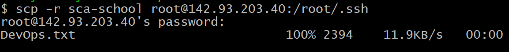
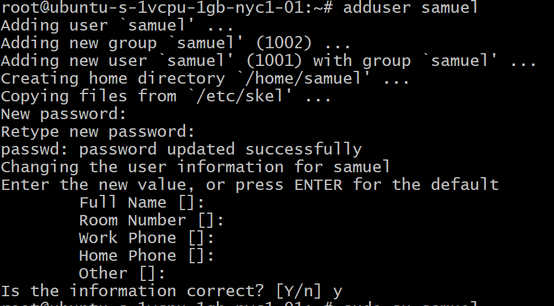
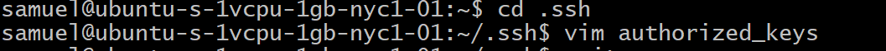
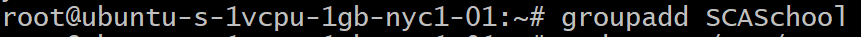
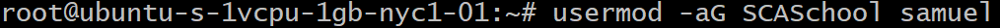
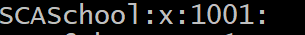
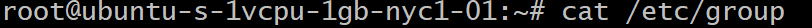
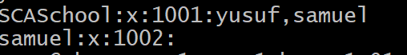
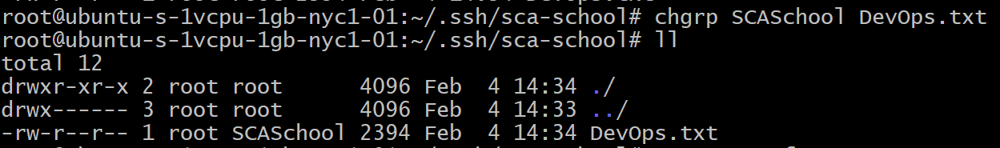
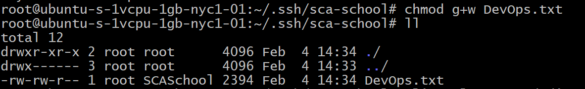

# SCA Cloud Application School Exercise

This readme very clearly describes the test process and it's output, it also shows the instructions and documentaion used in this excercise.

**A droplet was created from ditigal ocean**

**Copying a file to the VM cloud, this command was used**

*scp -r thename-of-the-directory username@ip-address:thepath*

**Creating a user on my VM, this command was used**

*adduser the-name-of-user*

**Adding the public file of the user, an authorized_key file was created with vim and the pub key pasted in it**

**Creating a group, this command was used**

*groupadd name-of-group*

**Adding a user to the group, this command was used**

*usermod -aG name-of-group user*

**To confirm if in group, this command was used**

*cat /etc/group*

**To change group owner**

*chgrp new-group-name file-name*

**To give permission to for a group to write**

*chmod g+w name-of-file*

*Note: rwx means; read, write, execute*

